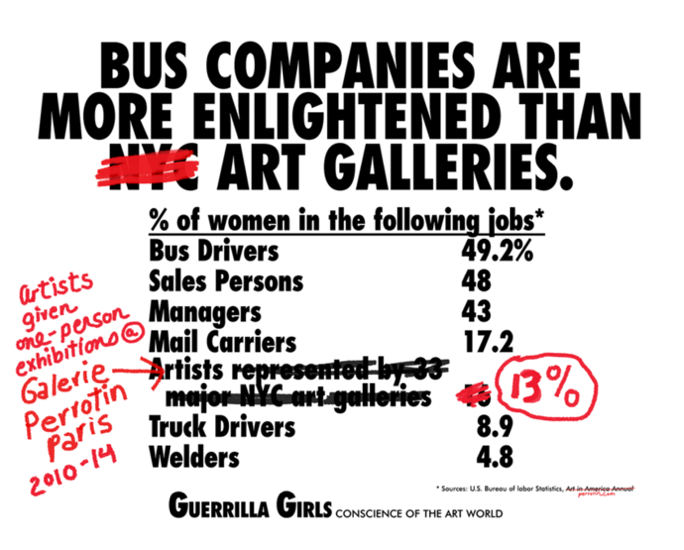
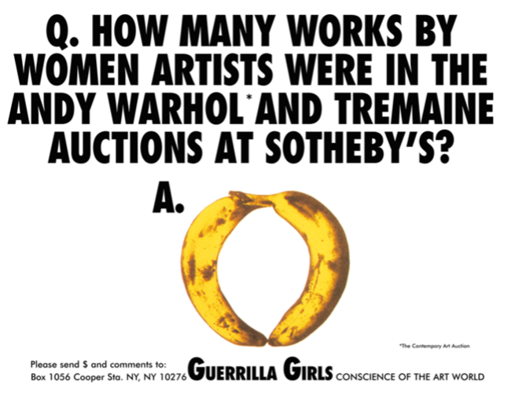
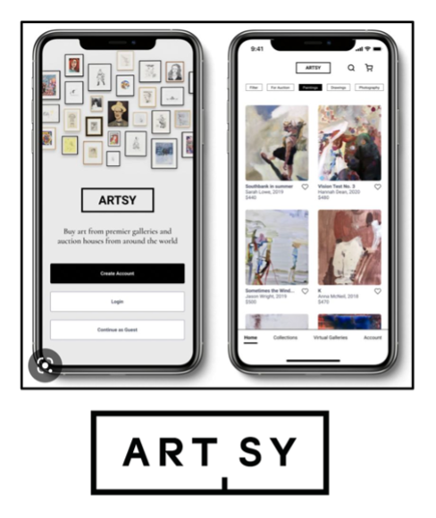
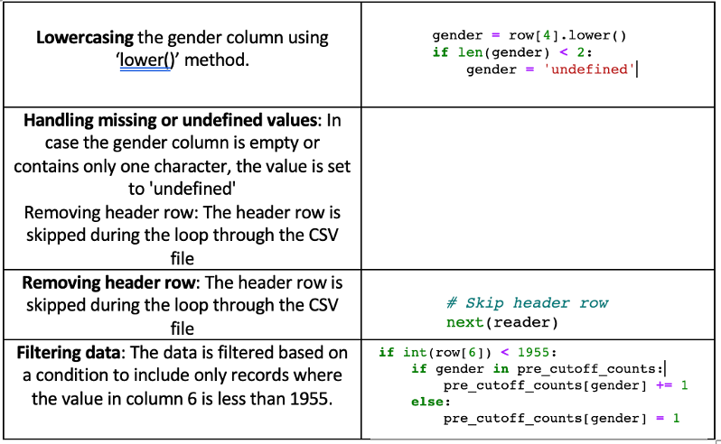
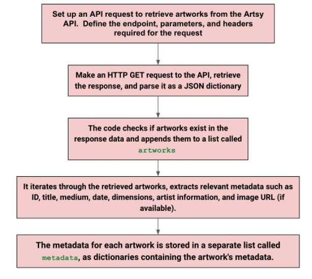

# An Analysis of Female Artists

Abstract

This project explores the underrepresentation of women in the art world and the mission of the Guerrilla Girls, a feminist art collective, to address gender and racial inequalities in the arts community. It discusses their use of culture jamming tactics to bring attention to disparities and discrimination within museums. It also highlights the Guerrilla Girls' findings regarding the low percentage of women artists exhibited compared to the prevalence of artworks featuring naked female bodies. Inspired by their work, the project outlines the aims of conducting a comprehensive analysis to examine the portrayal and representation of women in art history, the potential impact of societal changes on women artists' representation, and the broader underrepresentation of artists from various countries.

=======
Group Members: Tea Hassan, , Nicholas Ngan

## Motivation

Women have been source of inspiration for artists throughout history. From the Venus de Milo to Andy Warhol’s multi-coloured Marilyn, women (and especially naked women) have been plastered all over murals, exhibitions and museums. As two fellow art aficionados it struck us that all of our favourite pieces from all eras, were most, if not all, made by men. Why is it that women are at the centre of representation and yet not the ones behind the canvas? Why are there so little female artists? If art is supposed to depict an era, paint an accurate picture of the morals and ideals of that time, it appears as it that story has only be told by men, and thus leaves us with a biased recollection.

### The Guerrilla Girls

Our Interest was sparked when visiting an exhibition by the Guerrilla Girls at the Saatchi Gallery back in March. The Guerrilla Girls are a group of feminist, female artists who formed in 1985 in New York City. Their mission is to combat sexism and racism within the art world. Through culture jamming tactics such as posters, books, billboards, and public appearances, they bring attention to gender and racial inequalities in the arts community and society as a whole. The Guerrilla Girls use humour and anonymity, wearing gorilla masks and adopting pseudonyms, to shift the focus onto the issues they address rather than their individual identities or personal work. Their work exposes disparities, discrimination, corruption, and conflicts of interest within museums and aims to engage audiences through their thought-provoking messages.

When asked to create a billboard for the Public Art Fund, the Guerrilla Girls seized the opportunity to create something that would resonate with a wide audience. To gather data, they visited the Metropolitan Museum of Art and compared the number of women artists on display to the number of artworks featuring naked female bodies. The findings were eye-opening. However, the Public Art Fund rejected the billboard design, citing a lack of clarity. Undeterred, the Guerrilla Girls published their findings as an advertisement on New York City buses instead. Since then, they’ve done a few recounts are here are a few numbers:

| Year  | Percentage of female artists |
|:-----:|:----------------------------------------------------------------------------------------------:|
| 1989  | Less than 5% of artists in the Modern Art sections are women, but 85% of the nudes are female. |
| 2005	| Less than 3% of artists in the Modern Art sections are women, but 83% of the nudes are female. |
| 2012	| Less than 4% of artists in the Modern Art sections are women, but 76% of the nudes are female. |

Interestingly, unlike what we would have thought, the number of female artists exposed at the Met Museum decreased over the years!

Here are a few more of their insightful projects:

With all these numbers under our eyes, we couldn’t help but want to expand on the existing analysis. Indeed, while ground-breaking, The Guerrilla Girls’ projects were often restricted to a single exhibition or museum. We believed that we had the right tools at hand to conduct a multi-level analysis, that did not limit itself to a country or museum.

### Initials Aims

•	How has the portrayal of women changed throughout history?
•	As women are given more independence in society, are women artists being more represented in museums?
•	Why are there so little female artists? Or are they just underrepresented?

## Data Sources

The Official MoMa Data Set

As we started looking for data, we came across the official MoMa Data set in the form of two CSV files, one with listing artists one listing artworks, published on GitHub.
The Museum of Modern Art (MoMA) is a highly influential institution, making it essential for understanding the role of women in art. As a renowned museum with a vast collection, studying MoMA allows us to gain insights into the representation and contributions of women artists throughout history. By examining its exhibition history, we can trace the evolving narrative of women's participation in the art world.

The Museum of Modern Art (MoMA) is a highly influential institution, making it essential for understanding the role of women in art. As a renowned museum with a vast collection, studying MoMA allows us to gain insights into the representation and contributions of women artists throughout history. By examining its exhibition history, we can trace the evolving narrative of women's participation in the art world.

Dataset Characteristics

•	Data Volume: 138,185 artworks by 15,244 artists
•	Dataset includes:

- Basic metadata for each artist
-  Name
-  Nationality
-  Gender
-  Birth and death year
-  Wiki QID
-  Getty ULAN ID

The Artsy API

To enhance our analysis on women in art and not limit ourselves to one museum, we incorporated data from the Artsy API. By leveraging the extensive resources provided by Artsy, including information on artworks, artists, exhibitions, and galleries, we were able to enrich our understanding of the representation and experiences of women in the art world. The integration of Artsy API data allowed us to gather comprehensive insights and broaden the scope of our project, providing a more holistic view of women's contributions and challenges within the art community.

Artsy is an online platform that provides an extensive array of art-related services, encompassing art commerce, education, and a robust database. Established in 2009, Artsy boasts an exceptional database featuring over 1 million artworks and 100,000 artists, making it a highly comprehensive and valuable online resource for art information. Its offerings contribute to a thriving ecosystem for art enthusiasts, collectors, and professionals seeking unparalleled access to the art world. The Artsy API is an interface that allows developers to access and retrieve art-related data from the Artsy platform. It provides us with a structured way to interact with the vast collection of artworks, artists, exhibitions, and galleries stored in the Artsy database.

Dataset Characteristics

•	Data Volume: over 1 million artworks by more than 100,000 artists

Dataset includes:
-	Artist info: name, dates, nationality, bio
-	Artwork info: title, medium, date, dimensions, provenance and exhibition history
-	Gallery and museum info: name, location and exhibitions hosted
-	Auction data: sale date, auction house, sale price and lot number
-	Art market analysis: pricing trends, artist popularity and market outlook
-	Collection and curation data

## Methodology

### Data Collection and Data Wrangling

#### Data Collection MoMa Dataset

We collected the two CSV files from the Official MoMa GitHub Page:
https://github.com/MuseumofModernArt/collection

To extract the relevant data, we wanted from the two CSV files we had to go through a few manipulations, to make the data more readable:

Finally, we merged the two files ‘artworks MoMa’ and ‘artists MoMa’ to have them into a single csv file called ‘moma’

Here is a sample of the data:

Data Collection Artsy API

Working with the Artsy API was a more challenging endeavour. Between our final presentation and the project some time had passed, and the API had been completely updated, which meant the code we had so far did not work and we had to start all over.

The steps we followed are detailed in the chart below:

Here is a sample of the data:

2. Merging The Data

Once we were done extracting all the relevant data from the Artsy API we had to merge all our different csv files to create a final csv file that contained all the relevant information.  

We proceeded in the following way:
-	we merged the artists moma.csv and artworks moma. csv into a final moma.csv file
-	we merged the artists artsy. csv and artworks artsy.csv into a final artsy.csv

Then, we have to reshape the datasets so that they had the same column names. We saved these new datasets as moma_simple.csv and artsy_simple.csv. Here is a sample:

Finally, we merged these two data sets and saved the final dataset into a csv file merged.csv.

## Cleaning The Data Frames

To clean up the data, we created a code that defined a function called 'extract_year' that extracts the year from a given date. It removes whitespace from the 'Date' column in the 'artsy' data frame and converts it to numeric values. It also removes brackets from the 'Gender' and 'Nationality' columns in the 'moma' data frame and applies the 'extract_year' function to the 'Date' column to extract the year.

To ensure consistency between the two data frames, the code renames columns in both 'artsy' and 'moma' to match each other. It then merges the two data frames into a new data frame called 'df'.
We performed further data cleaning by removing rows with missing values in the 'Date' column of the 'df' data frame and converting the 'Date' column to integer values. The 'Gender' column is cleaned up using the 'decide_gender' function, which converts gender strings to lowercase, splits them into words, and determines the dominant gender based on word counts. To provide additional information, the code defines a function called 'year_to_century' that converts the year to a century. It adds a new column 'Century' to the 'df' data frame by applying the 'year_to_century' function to the 'Date' column. Rows with 'Century' values greater than 21 are removed from the 'df' data frame.

Finally, the code summarises the data by grouping the 'df' data frame based on 'Century' and 'Gender' columns and calculates the count of each group. The summarised data is stored in a new data frame called 'summary_df', which includes columns 'Century', 'Gender', and 'Count'.
This is useful for preparing and merging art data from two different sources, allowing for comprehensive analysis and visualisation. By cleaning and transforming the data, it ensures data quality and enables us to gain insights into the gender distribution and artistic trends across different centuries.

## Exploratory Data Analysis

Now equipped with our clean and tidy data frames, we can move onto the analysis of the data. We reiterate our initial goals:
•	How has the portrayal of women changed throughout history?
•	As women are given more independence in society, are women artists being more represented in museums?
•	Why are there so little female artists? Or are they just underrepresented?

Summary Statistics

### MoMa Dataset

These summary statistics for the MoMa Data provide a snapshot of a dataset containing information about art pieces. The dataset includes over 140,000 observations, with almost 100,000 unique titles and more than 13,000 unique artists. The most common title in the dataset is "Untitled," appearing over 8,500 times, while the artist "Eugène Atget" is the most frequent, with over 5,000 occurrences. The majority of the artists in the dataset are identified as American, and the gender distribution is heavily skewed towards male artists, with over 105,000 instances.

### Artsy Dataset

These summary statistics for the Artsy Data  provide an overview of a dataset containing information about art pieces. The dataset consists of approximately 140,000 observations. There are nearly 100,000 unique titles and over 17,000 unique IDs. The most common title in the dataset is "Untitled," appearing around 8,500 times. The majority of the artists in the dataset have French nationality, with a frequency of approximately 19,000. The dataset includes four unique gender categories, with "male" being the most common, occurring over 65,000 times. However, it's worth noting that the "Name" attribute has missing or unspecified top and frequency values, which implies some missing data or variability in the dataset. (add note about missing data)
Proportion of Men vs Women Artists
The first natural question that comes to mind is how many women artists there are compared to men artists. In order to provide an answer, we first counted how many male and female artists were in each dataset and then added them up to create a final number. We tried to directly analyse the merged.csv file but the file was too big and we encountered many crashes. It was easier for us to break down the process.

### Proportion of Men vs Women Artists

The first natural question that comes to mind is how many women artists there are compared to men artists. In order to provide an answer, we first counted how many male and female artists were in each dataset and then added them up to create a final number. We tried to directly analyse the merged.csv file but the file was too big and we encountered many crashes. It was easier for us to break down the process.

We first counted the number of male and female artist present in the MoMa dataset:

Total artworks: 140851
Female artists: 18830
Male artists: 105689

Then, we plotted the results in a pie chart using plotly:

Unsurprisingly, the proprtion of male artists compared to female artists in the MoMa Data set is much higher.

We then did the same for the Artsy Dataset:

Total artworks: 140851
Female artists: 963
Male artists: 65806

For the Artsy Data, the proportion of women artists is even smaller. This is probably due to the fact that the Artsy API extract data from all time periods, starting in around the 1500s, where there were relatively no female artists as women had a very limited role in society. Since MoMa exposes Modern and Contemporary Art, which starts around the 1950s, it makes sense that they expose a lot more female artists.

Finally, we combined the results to get a final count:

note: the other factor accounts for rows with missing data where the gender was not specified, it also encompasses gender neutral artists.

From these final plots, it is clear that male artists are heavily overrepresented. What is interesting is that from the MoMA data we understand that male artists are more exposed in museums, as the MoMa provides us with data about what is in the MoMa collection but also in private collections and small galleries as the Arsty Database provides us with data on artworks from all sorts of collections, from very prestigious museums and galleries to more local and niche ones. Through the use of these two datasets we clearly see that the underrepresentation of women in art is a global phenomenon that needs to be addressed.

Country Analysis

We then performed an analysis to see if the phenomenon identified in the previous section was global or located in certain countries. We came up with the following results:

We first counted the number of male and female artist present in the MoMa dataset:

Then, we plotted the results in a pie chart using plotly:

Unsurprisingly, the proportion of male artists compared to female artists in the MoMa Data set is much higher.

This plot shows a world map visualisation of artwork counts by country intensity. Interestingly, it shows that me most artworks are generated by France and some other European countries. This aligns with our predictions that not only women are underrepresented but different nationalities as well.

K Means Clustering Analysis

Definition: K-means clustering is a machine learning algorithm that groups similar data points together based on their feature similarities. It aims to partition the data into a predetermined number of clusters, where each data point belongs to the cluster with the nearest mean (centroid). The algorithm iteratively adjusts the cluster centroids until the clustering solution converges, resulting in distinct groups or clusters of data points.

We performed a k- means clustering analysis to see what factors affect the gender of art. It selects numeric columns from the dataset, normalises the data, applies principal component analysis (PCA) to reduce dimensionality, determines the optimal number of clusters using the elbow method, assigns data points to clusters based on the chosen number of clusters, and finally visualises the clusters on a scatter plot. The analysis helps identify patterns and relationships between gender and the selected features in the dataset.

Creating the clusters and principal components of the analysis:

Based on the elbow method applied to the clustering results, it becomes evident that selecting 2 or 3 clusters is appropriate for distinguishing gender in the dataset. The elbow point in the plot indicates a significant drop in the within-cluster sum of squares (WCSS) as the number of clusters increases, implying that the most substantial gains in clustering accuracy are achieved with 2 or 3 clusters. This finding aligns with the expectation that the majority of the data points predominantly belong to the male or female clusters, while only a small percentage is categorised as "other," suggesting a clear gender differentiation in the dataset.

Results:

We generated a scatter plot to visualise the clusters obtained from the k-means clustering analysis. It plots the data points in the two-dimensional space defined by the principal components 'PC1' and 'PC2'.  The code first plots the data points that belong to cluster 0, representing the 'Male' cluster, as blue dots. It then plots the data points belonging to cluster 1, representing the 'Female' cluster, as red dots. The 's' parameter determines the size of the dots, while the 'c' parameter assigns colours to the dots based on the cluster label. The plot is given a title of 'Clusters of Artworks by Gender' and labels the x-axis as 'PCA 1' and the y-axis as 'PCA 2'. The legend indicates the colours associated with each cluster label ('Male' and 'Female'). The plot provides a clear representation of how the data points are grouped based on the identified gender categories.

Unsurprisingly, we find a lot more data points associated with the male cluster (blue dots).

The analysis demonstrates that the data has been effectively mapped back after performing PCA and k-means clustering. By examining the PCA components used in the analysis, it becomes apparent that they mainly capture features related to the year of artwork release. Consequently, it can be inferred that artworks created by women are relatively more recent compared to those created by men, as indicated by the clustering results and the distribution of data points along the principal components.

Analysis over Time

From this, we performed an analysis of over time to see when most artworks were created and how the proportion of female artists evolved over centuries.

Here are our results:

Again, this is coherent with our hypothesis that there are more female artists as recently and that the proportion grows over time.

Final Results

1.	There are significantly more male than female artists
2.	The proportion of female artists has grown over time
3.	There is also underrepresentation of many other countries

Problems Faced

During the data analysis process, several challenges were encountered. One significant issue was the presence of missing values in the dataset, which required extensive data cleaning to ensure the reliability and completeness of the results. Additionally, the files containing the data were large and difficult to handle, leading to slower processing and making it challenging to read and manipulate the data efficiently. The data processing also required a substantial amount of time due to the extensive amount of information to go through, and the program would occasionally crash, causing further delays and interruptions. Another obstacle was the inconsistent or missing gender information for artworks, which often posed difficulties when attempting to categorise and analyse the data based on gender.

## Conclusion

In conclusion, the underrepresentation of female artists in the art world is a significant issue that calls for attention and action. Despite the central role women have played as subjects in art, their presence as creators has been limited throughout history. The work of the Guerrilla Girls, a group of feminist artists, highlights the gender and racial inequalities that persist in the arts community. Through their thought-provoking projects, they have exposed the disparities in representation, revealing the low percentage of women artists compared to the abundance of artworks featuring female bodies.

The analysis conducted aimed to expand on the Guerrilla Girls' efforts by providing a broader and more comprehensive examination of gender representation in art across different countries and museums. The findings confirmed the existing gender imbalance, with a significantly higher number of male artists compared to female artists. However, there were indications of progress over time, with a growing proportion of female artists being represented in museums. The analysis also revealed that the underrepresentation issue extends beyond gender, as many countries are not adequately represented in the art world. This lack of diversity calls for greater efforts to promote inclusivity and provide platforms for artists from diverse backgrounds to showcase their work.

Finally, the art world must address the biases and inequalities that persist in order to create a more inclusive and representative environment. It is crucial to recognise and celebrate the contributions of female artists and artists from underrepresented groups, ensuring that their voices and perspectives are heard and appreciated. Only by embracing diversity and challenging the existing norms can the art world truly reflect the rich and varied experiences of humanity.
