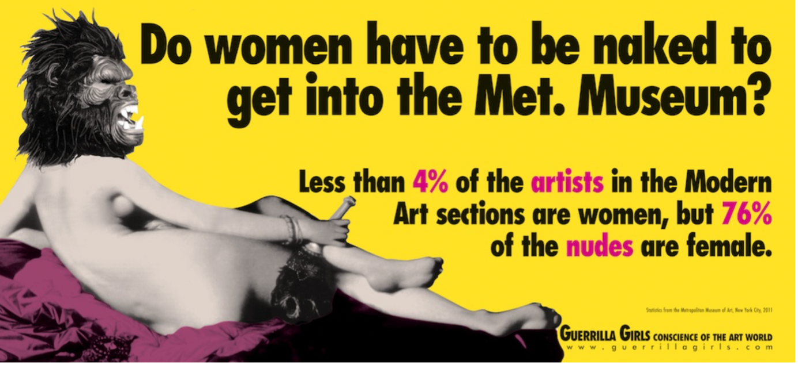

## An Analysis of Female Artists

Group Members: Tea Hassan

## Motivation

Women have been source of inspiration for artists throughout history. From the Venus de Milo to Andy Warhol’s multi-coloured Marilyn, women (and especially naked women) have been plastered all over murals, exhibitions and museums. As two fellow art aficionados it struck us that all of our favourite pieces from all eras, were most, if not all, made by men. Why is it that women are at the centre of representation and yet not the ones behind the canvas? Why are there so little female artists? If art is supposed to depict an era, paint an accurate picture of the morals and ideals of that time, it appears as it that story has only be told by men, and thus leaves us with a biased recollection.

The Guerrilla Girls 
 
Our Interest was sparked when visiting an exhibition by the Guerrilla Girls at the Saatchi Gallery back in March. The Guerrilla Girls are a group of feminist, female artists who formed in 1985 in New York City. Their mission is to combat sexism and racism within the art world. Through culture jamming tactics such as posters, books, billboards, and public appearances, they bring attention to gender and racial inequalities in the arts community and society as a whole. The Guerrilla Girls use humor and anonymity, wearing gorilla masks and adopting pseudonyms, to shift the focus onto the issues they address rather than their individual identities or personal work. Their work exposes disparities, discrimination, corruption, and conflicts of interest within museums and aims to engage audiences through their thought-provoking messages.

When asked to create a billboard for the Public Art Fund, the Guerrilla Girls seized the opportunity to create something that would resonate with a wide audience. To gather data, they visited the Metropolitan Museum of Art and compared the number of women artists on display to the number of artworks featuring naked female bodies. The findings were eye-opening. However, the Public Art Fund rejected the billboard design, citing a lack of clarity. Undeterred, the Guerrilla Girls published their findings as an advertisement on New York City buses instead. Since then, they’ve done a few recounts are here are a few numbers: 

| Year  | Percentage of female artists |
|:-----:|:----------------------------------------------------------------------------------------------:|
| 1989  | Less than 5% of artists in the Modern Art sections are women, but 85% of the nudes are female. |
| 2005	| Less than 3% of artists in the Modern Art sections are women, but 83% of the nudes are female. |
| 2012	| Less than 4% of artists in the Modern Art sections are women, but 76% of the nudes are female. |

Interestingly, unlike what we would have thought, the number of female artists exposed at the Met Museum decreased over the years! 

Here are a few more of their insightful projects:

## Data Sources

The Official MoMa Data Set 

As we started looking for data, we came across the official MoMa Data set in the form of two CSV files, one with listing artists one listing artworks, published on GitHub. 
The Museum of Modern Art (MoMA) is a highly influential institution, making it essential for understanding the role of women in art. As a renowned museum with a vast collection, studying MoMA allows us to gain insights into the representation and contributions of women artists throughout history. By examining its exhibition history, we can trace the evolving narrative of women's participation in the art world.

The Museum of Modern Art (MoMA) is a highly influential institution, making it essential for understanding the role of women in art. As a renowned museum with a vast collection, studying MoMA allows us to gain insights into the representation and contributions of women artists throughout history. By examining its exhibition history, we can trace the evolving narrative of women's participation in the art world.

Dataset Characteristics

•	Data Volume: 138,185 artworks by 15,244 artists 
•	Dataset includes:
- Basic metadata for each artist 
-  Name 
-  Nationality 
-  Gender 
-  Birth and death year 
-  Wiki QID 
-  Getty ULAN ID 

The Artsy API 

To enhance our analysis on women in art and not limit ourselves to one museum, we incorporated data from the Artsy API. By leveraging the extensive resources provided by Artsy, including information on artworks, artists, exhibitions, and galleries, we were able to enrich our understanding of the representation and experiences of women in the art world. The integration of Artsy API data allowed us to gather comprehensive insights and broaden the scope of our project, providing a more holistic view of women's contributions and challenges within the art community.

Artsy is an online platform that provides an extensive array of art-related services, encompassing art commerce, education, and a robust database. Established in 2009, Artsy boasts an exceptional database featuring over 1 million artworks and 100,000 artists, making it a highly comprehensive and valuable online resource for art information. Its offerings contribute to a thriving ecosystem for art enthusiasts, collectors, and professionals seeking unparalleled access to the art world. The Artsy API is an interface that allows developers to access and retrieve art-related data from the Artsy platform. It provides us with a structured way to interact with the vast collection of artworks, artists, exhibitions, and galleries stored in the Artsy database. 

Dataset Characteristics 

•	Data Volume: over 1 million artworks by more than 100,000 artists
•	Dataset includes:
-	Artist info: name, dates, nationality, bio
-	Artwork info: title, medium, date, dimensions, provenance and exhibition history
-	Gallery and museum info: name, location and exhibitions hosted 
-	Auction data: sale date, auction house, sale price and lot number 
-	Art market analysis: pricing trends, artist popularity and market outlook
-	Collection and curation data

|  Variable 1    | Variable 2  |  Variable 3  | Variable 4   | Variable 6    |  Variable 6             |       Variable 7     | 
|:--------------:|:-----------:|:------------:|:------------:|:-------------:|:-----------------------:|:--------------------:|
| A              |       1     |      5       |        9     |        13     |          17             |             21       |   
| B              |       2     |      6       |       10     |        14     |          18             |             22       |  
| C              |       3     |      7       |       11     |        15     |          19             |             23       |  
| D              |       4     |      8       |       12     |        16     |          20             |             24       |   

## Methodology

1) Data Collection and Data Wrangling 

Data Collection MoMa Dataset

To extract the relevant data, we wanted from the two CSV files we had to go through a few manipulations, to make the data more readable: 

Data Collection Artsy API 

Lorem ipsum dolor sit amet, consectetur adipiscing elit. Nulla vel erat in ligula gravida tincidunt vitae in tellus. Suspendisse ultrices tortor ac odio mattis volutpat. Integer aliquet turpis quis elit egestas vulputate ac eu mauris. Praesent ac lacus id nulla venenatis semper porta eu lacus. Integer nec pretium lorem. Sed at massa tincidunt, mollis quam ut, consequat massa. Praesent eu diam quam. Nulla auctor dolor quam. Vestibulum cursus quis turpis vitae dictum. Sed quis ipsum purus. Nunc eu eleifend tortor. Maecenas quis eros ut urna semper auctor in ac magna. In hac habitasse platea dictumst. Nullam dolor risus, mollis a.

## Findings

Lorem ipsum dolor sit amet, consectetur adipiscing elit. Nulla vel erat in ligula gravida tincidunt vitae in tellus. Suspendisse ultrices tortor ac odio mattis volutpat. Integer aliquet turpis quis elit egestas vulputate ac eu mauris. Praesent ac lacus id nulla venenatis semper porta eu lacus. Integer nec pretium lorem. Sed at massa tincidunt, mollis quam ut, consequat massa. Praesent eu diam quam. Nulla auctor dolor quam. Vestibulum cursus quis turpis vitae dictum. Sed quis ipsum purus. Nunc eu eleifend tortor. Maecenas quis eros ut urna semper auctor in ac magna. In hac habitasse platea dictumst. Nullam dolor risus, mollis a.

## Conclusion

Lorem ipsum dolor sit amet, consectetur adipiscing elit. Nulla vel erat in ligula gravida tincidunt vitae in tellus. Suspendisse ultrices tortor ac odio mattis volutpat. Integer aliquet turpis quis elit egestas vulputate ac eu mauris. Praesent ac lacus id nulla venenatis semper porta eu lacus. Integer nec pretium lorem. Sed at massa tincidunt, mollis quam ut, consequat massa. Praesent eu diam quam. Nulla auctor dolor quam. Vestibulum cursus quis turpis vitae dictum. Sed quis ipsum purus. Nunc eu eleifend tortor. Maecenas quis eros ut urna semper auctor in ac magna. In hac habitasse platea dictumst. Nullam dolor risus, mollis a.
